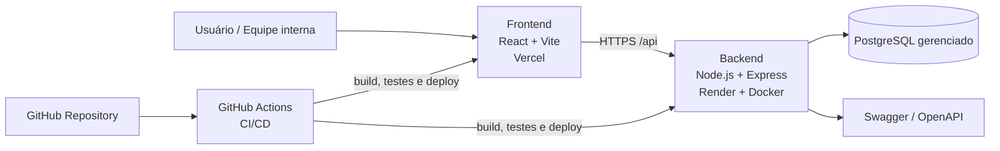

# Relatório Técnico — ComprovOS

## 1) Identificação do projeto

- Projeto: **ComprovOS**
- Disciplina: **Desenvolvimento de Software em Nuvem**
- Período: **2026**
- Repositório: <https://github.com/guimaraesander/comprovos>
- Módulos principais: `backend/`, `frontend/`, `.github/workflows/`, `docs/`

## 2) Objetivo do trabalho

Desenvolver e implantar uma aplicação web para controle de ordens de serviço e clientes de assistência técnica, composta por:

- autenticação e autorização com JWT e controle por perfil
- API RESTful para operações de negócio
- interface web para operação interna
- persistência em banco relacional gerenciado
- documentação técnica da API (Swagger/OpenAPI)
- observabilidade básica, testes automatizados e pipeline CI/CD com deploy

## 3) Arquitetura implementada

### 3.1 Arquitetura geral

- **Frontend:** React + Vite + TypeScript
- **Backend:** Node.js + Express + TypeScript
- **Banco:** PostgreSQL (serviço gerenciado)
- **ORM:** Prisma
- **Autenticação:** JWT
- **Documentação de API:** Swagger/OpenAPI

### 3.2 Camadas e responsabilidades

- **Frontend:** rotas protegidas, autenticação do usuário e consumo da API.
- **Backend (camada de rotas/controle):** endpoints REST por domínio (`clients`, `users`, `service-orders`, `auth`).
- **Backend (camada de serviço):** regras de negócio e transições de status.
- **Persistência:** Prisma para acesso e modelagem de dados.
- **Infraestrutura:** Docker para o backend e pipelines em GitHub Actions.

### 3.3 Comunicação

- O frontend consome o backend pela variável `VITE_API_URL` (`/api`).
- A API expõe rotas e documentação em `/api` e `/api-docs`.
- Deploy de produção registrado em:
  - Frontend: <https://comprovos.vercel.app>
  - Backend: <https://comprovos-backend.onrender.com>

### 3.4 Diagrama de arquitetura em nuvem

### 3.5 Tecnologias e serviços utilizados

- **Frontend:** React, Vite, TypeScript e Vitest.
- **Backend:** Node.js, Express, TypeScript, Prisma, JWT e Supertest.
- **Banco de dados:** PostgreSQL em serviço gerenciado.
- **Documentação de API:** Swagger/OpenAPI.
- **Infraestrutura e deploy:** Docker, Render e Vercel.
- **Integração contínua:** GitHub Actions com execução automatizada de build, testes e publicação de artefatos de cobertura.

## 4) Requisitos atendidos

## 4.1 Requisitos funcionais

- Autenticação e autorização implementadas com JWT e perfis `ADMIN` e `TECNICO`.
- API documentada com Swagger/OpenAPI.
- Operações CRUD completas para clientes, usuários e ordens de serviço.
- Validação de dados no backend com tratamento centralizado de validação e erros.
- Logs de acesso e erro implementados no backend.

## 4.2 Requisitos de arquitetura e nuvem

- Frontend desenvolvido com React.
- Frontend implantado em nuvem na Vercel.
- Backend containerizado com Docker.
- Backend implantado em nuvem.
- Banco de dados gerenciado fora do container, acessado via `DATABASE_URL`.

## 4.3 DevOps e operações

- Pipeline com build e testes automatizados no backend.
- Pipeline com build e testes automatizados no frontend.
- Deploy automático via CI/CD com webhooks.
- Evidências de execução publicadas no repositório por meio do workflow.

### Estratégia de deploy e CI/CD

- O pipeline é executado pelo GitHub Actions nos eventos de `push`, `pull_request` e acionamento manual.
- O backend roda em job próprio com banco PostgreSQL temporário em `service container`, geração do Prisma Client, testes com cobertura e etapa de build.
- O frontend roda em job separado com instalação de dependências, testes com cobertura e build de produção.
- O deploy automático ocorre após a aprovação das etapas anteriores, utilizando webhooks configurados por segredos do repositório para disparar a publicação no Render e na Vercel.
- A estratégia adotada separa validação e publicação, reduzindo o risco de promover código sem teste para produção.

## 4.4 Segurança e boas práticas

- Uso de variáveis de ambiente como `DATABASE_URL`, `JWT_SECRET`, `PORT` e `NODE_ENV`.
- Proteção de rotas autenticadas.
- Tratamento centralizado de erros.
- Separação entre ambientes de desenvolvimento, teste e produção observável em runtime, sem fallback inseguro de segredos.

## 4.5 Testes e qualidade

- Testes de backend com Vitest e Supertest.
- Testes de frontend cobrindo cenários essenciais da interface.
- Cobertura automática de testes configurada e executada no backend e no frontend.

## 4.6 Colaboração (itens acadêmicos)

- Repositório público no GitHub.
- Branches por funcionalidade.
- Commits semânticos.
- Organização das atividades com Issues e Kanban no GitHub.

### Papéis da equipe

- Anderson Guimarães Almino — Arquiteto(a) de Software em Nuvem
- Anderson Ferreira — Desenvolvedor(a) Back-end
- Átila Góis — Desenvolvedor(a) Front-end
- João Lino — Engenheiro(a) DevOps
- Luan — Responsável por Qualidade e Testes
- Larissa — Documentação e Integração

### Contribuições da equipe

- **Anderson Guimarães Almino:** conduziu a arquitetura geral da solução em nuvem, a integração entre frontend e backend, a evolução dos módulos principais, a documentação técnica e a consolidação do fluxo de CI/CD e entrega.
- **Anderson Ferreira:** concentrou contribuições no backend, com implementação de logs, infraestrutura de testes automatizados e testes de integração/validação de operações de autenticação e CRUD.
- **Átila Góis:** atuou no frontend, especialmente na experiência da tela de login, em ajustes de interface e na criação de testes de renderização e comportamento da página.
- **João Lino:** contribuiu na preparação de ambiente e fluxo de deploy, apoiando a estabilização do frontend para publicação.
- **Luan:** responsável pelo acompanhamento de qualidade e testes na etapa final de validação da entrega.
- **Larissa:** responsável pela organização da documentação e integração das evidências acadêmicas e técnicas da entrega.

### Evidência de organização do trabalho

Para registrar a organização das atividades do projeto, foi utilizado o GitHub com **Issues** e **GitHub Projects (Kanban)**. O quadro foi estruturado com as colunas **Todo**, **In Progress** e **Done**, permitindo visualizar as tarefas pendentes, em andamento e concluídas.

As principais entregas do projeto foram distribuídas no board, incluindo frontend, backend, autenticação, persistência com banco de dados, documentação da API, testes automatizados, deploy em nuvem e ajustes finais de documentação.

Como a maior parte do desenvolvimento técnico já estava concluída no momento da consolidação acadêmica, as entregas implementadas foram posicionadas em **Done**, mantendo em andamento apenas os ajustes finais da documentação e da entrega. Dessa forma, o projeto passou a apresentar evidência visual e verificável da organização do fluxo de trabalho no GitHub.

### Links de validação
- Repositório: <https://github.com/guimaraesander/comprovos>
- GitHub Projects (Kanban): <https://github.com/users/guimaraesander/projects/1/views/1>

## 5) Evidências técnicas

- Workflow CI/CD: `.github/workflows/ci.yml`
- Deploy e validação: <https://github.com/guimaraesander/comprovos/actions/workflows/ci.yml>
- Backend em produção: <https://comprovos-backend.onrender.com>
- Frontend em produção: <https://comprovos.vercel.app>
- API docs: <https://comprovos-backend.onrender.com/api-docs>
- Health check: <https://comprovos-backend.onrender.com/health>
- Board Kanban / GitHub Projects: <https://github.com/users/guimaraesander/projects/1/views/1>

## 6) Dificuldades encontradas, soluções adotadas e riscos controlados

- **Integração entre frontend e backend em ambientes distintos:** foi necessário padronizar o uso de variáveis de ambiente, especialmente `VITE_API_URL` no frontend e `DATABASE_URL`/`JWT_SECRET` no backend. Como solução, o projeto passou a centralizar a configuração por ambiente e validar variáveis críticas na inicialização.
- **Deploy confiável com validação prévia:** havia o risco de publicar versões sem checagem automatizada. A solução adotada foi estruturar um workflow no GitHub Actions com jobs separados para backend e frontend, testes automatizados, build e deploy posterior via webhooks.
- **Geração do Prisma Client e consistência de ambiente:** ajustes foram necessários para garantir compatibilidade entre instalação, build em container e execução em CI. A solução foi explicitar a geração do Prisma Client no fluxo automatizado e alinhar scripts de instalação e build.
- **Cobertura de testes e regressões em autenticação/interface:** o comportamento de erro no login e as rotas do backend exigiram validação adicional. Como solução, foram adicionados testes de backend com Vitest + Supertest e testes de frontend voltados para renderização, autenticação e mensagens de erro.
- **Compatibilidade do Prisma com mudanças recentes da ferramenta:** o projeto utiliza `datasource` com `url` em `backend/prisma/schema.prisma`, e há aviso de migração para formato mais novo em versões recentes. A solução adotada foi manter a configuração estável até a entrega, registrando o ponto como limitação técnica controlada para evitar regressão de última hora.

## 7) Execução e validação realizada

- Testes automatizados do frontend e backend executados com sucesso no estado atual de implementação.
- Correções realizadas para garantir comportamento de erro amigável na autenticação.
- Pipeline principal executado com sucesso em ambiente de integração.
- Interface e fluxo de login validados para:
  - credenciais válidas;
  - credenciais inválidas (mensagem amigável);
  - indisponibilidade de backend (mensagem de conexão).

## 8) Demonstração em vídeo

A entrega prevê um vídeo de demonstração com até 7 minutos, contemplando:

- arquitetura da solução
- funcionamento do sistema
- deploy em nuvem
- pipeline e/ou testes automatizados

O material de vídeo deve ser registrado e referenciado em `docs/video-demonstracao.md`.

## 9) Conclusão

A solução cumpre os requisitos técnicos centrais da disciplina, com arquitetura em nuvem, backend em container, documentação de API, autenticação protegida, rotinas de teste e pipeline com CI/CD.

Pontos pendentes para encerramento acadêmico final:

- incluir vídeo de demonstração (até 7 min) com link em `docs/video-demonstracao.md`.

Portanto, no que tange ao funcionamento técnico e requisitos arquiteturais, o projeto encontra-se apto para entrega.
