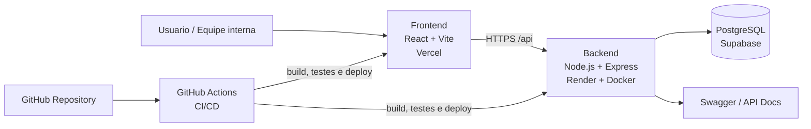

# Relatório Técnico: Sistema ComprovOS

**Fundação Edson Queiroz**  
**Tecnólogo em Análise e Desenvolvimento de Sistemas**

- Anderson Guimarães Almino - Matrícula: 2425080
- Antonio Anderson Ferreira dos Santos - Matrícula: 2415502
- Atila Alves Góis - Matrícula: 2415587
- João Victor Demetrio Lino - Matrícula: 2415523
- Larissa Silva Fernandes - Matrícula: 2416657
- Luan Wesley Cândido Silva - Matrícula: 2425130

- Disciplina: Desenvolvimento de Software em Nuvem
- Professor: Ildo Ramos Vieira
- Local: Fortaleza-CE
- Ano: 2026

## Sumário

1. [Visão Geral do Sistema](#1-visão-geral-do-sistema)
2. [Diagrama de Arquitetura em Nuvem](#2-diagrama-de-arquitetura-em-nuvem)
3. [Tecnologias e Serviços Utilizados](#3-tecnologias-e-serviços-utilizados)
4. [Estratégia de Deploy e CI/CD](#4-estratégia-de-deploy-e-cicd)
5. [Papéis e Contribuições da Equipe](#5-papéis-e-contribuições-da-equipe)
6. [Evidências Técnicas](#6-evidências-técnicas)
7. [Dificuldades Encontradas e Soluções Adotadas](#7-dificuldades-encontradas-e-soluções-adotadas)
8. [Execução, Validação e Resultados](#8-execução-validação-e-resultados)
9. [Atendimento aos Requisitos da Proposta](#9-atendimento-aos-requisitos-da-proposta)
10. [Conclusão](#10-conclusão)

---

## 1. Visão Geral do Sistema

O ComprovOS é um sistema web voltado à gestão de ordens de serviço, clientes e fluxo operacional de assistência técnica. A solução foi concebida em arquitetura cliente-servidor, com interface acessível via navegador, backend exposto por API RESTful e persistência em banco de dados relacional gerenciado em nuvem. O objetivo do projeto é substituir controles manuais por um processo digital com maior rastreabilidade, padronização e segurança operacional.

Em termos funcionais, a aplicação contempla autenticação e autorização por perfis, operações CRUD, validação de dados no back-end, documentação da API via Swagger/OpenAPI e registro de logs de acesso e erro. O sistema também foi estruturado para atender aos requisitos da disciplina relacionados a computação em nuvem, containerização do back-end, testes automatizados, boas práticas de segurança e automação do processo de entrega.

---

## 2. Diagrama de Arquitetura em Nuvem

A arquitetura do ComprovOS distribui responsabilidades entre apresentação, serviços, persistência e automação. O frontend React é publicado na Vercel; o backend Node.js/Express é empacotado com Docker e executado no Render; os dados permanecem em PostgreSQL gerenciado no Supabase, fora do container da aplicação; e o GitHub Actions centraliza o pipeline de integração contínua e deploy.

Figura 1 - Arquitetura em nuvem do sistema ComprovOS.

---

## 3. Tecnologias e Serviços Utilizados

- Frontend: React, Vite, TypeScript, Tailwind CSS, Vitest e React Testing Library.
- Backend: Node.js, Express, TypeScript, Prisma ORM, JWT, Vitest e Supertest.
- Banco de dados: PostgreSQL em serviço gerenciado (Supabase), garantindo persistência fora do container.
- Documentação de API: Swagger/OpenAPI disponível em endpoint próprio para consulta e validação dos contratos da API.
- Infraestrutura em nuvem: Vercel para publicação do frontend e Render para execução do backend containerizado.
- DevOps e colaboração: Git, GitHub, GitHub Actions, Issues e GitHub Projects (Kanban).
- Ferramentas de desenvolvimento: VS Code, Thunder Client, ESLint, Prettier, DotENV e GitLens.

---

## 4. Estratégia de Deploy e CI/CD

A estratégia de entrega foi organizada com uso de branches por funcionalidade, integração por pull requests e promoção para a branch principal após validação. O back-end foi empacotado com Docker, atendendo ao requisito de execução em ambiente containerizado, enquanto o banco de dados permaneceu desacoplado em serviço gerenciado, garantindo persistência fora do container.

O pipeline de CI/CD foi implementado com GitHub Actions e automatiza as etapas de instalação de dependências, geração do Prisma Client, build do backend e do frontend, execução de testes automatizados e disparo de deploy quando a validação é concluída com sucesso. Em produção, o frontend é publicado na Vercel e o backend no Render, mantendo credenciais e parâmetros críticos em variáveis de ambiente, como `DATABASE_URL`, `JWT_SECRET`, `PORT` e `NODE_ENV`. Essa estratégia contribui para a segurança, repetibilidade do processo e redução do risco de promover código não validado para produção.

---

## 5. Papéis e Contribuições da Equipe

Conforme a proposta da atividade, a equipe foi estruturada em seis funções técnicas claras, cobrindo arquitetura em nuvem, DevOps, back-end, front-end, segurança, qualidade e documentação. As contribuições consolidadas foram as seguintes:

- João Victor Demetrio Lino - Arquiteto de Software em Nuvem / Deploy: responsável pela publicação do sistema em produção, configuração de URLs e variáveis de ambiente e adequação do backend containerizado no Render, integrando frontend, backend e banco em nuvem.
- Anderson Guimarães Almino - Engenheiro de DevOps / CI/CD: responsável pela criação e manutenção do fluxo automatizado no GitHub Actions, integrando build, testes e deploy, além da configuração segura de segredos utilizados na publicação.
- Antonio Anderson Ferreira dos Santos - Desenvolvedor Backend e QA: responsável pela implementação de testes da API, validações do backend, logs de acesso e erro e robustez das rotas de autenticação e das operações CRUD.
- Atila Alves Góis - Desenvolvedor Frontend e UI: responsável pelos testes de interface, estados de loading e erro, responsividade do dashboard, correções visuais e integração da camada de apresentação com a API.
- Luan Wesley Cândido Silva - Segurança: responsável pela implementação e validação do controle de acesso por perfis, proteção de rotas e revisão do comportamento de autenticação nas camadas de frontend e backend.
- Larissa Silva Fernandes - Gestão e Documentação: responsável pela organização do Kanban, consolidação do relatório técnico, coleta de evidências da entrega e apoio à demonstração final do projeto.

### 5.1 Evidência de organização do trabalho

A organização do desenvolvimento foi registrada em repositório público no GitHub, com uso de branches por funcionalidade, commits semânticos e GitHub Projects no formato Kanban. O quadro foi estruturado com colunas como `Todo`, `In Progress` e `Done`, permitindo acompanhar atividades de frontend, backend, autenticação, persistência, testes, deploy e documentação. Essa estrutura reforçou a colaboração, a rastreabilidade e a visibilidade do progresso da equipe ao longo da execução do projeto.

---

## 6. Evidências Técnicas

- Repositório público: <https://github.com/guimaraesander/comprovos>
- Workflow de CI/CD: `.github/workflows/ci.yml` e histórico de execuções em GitHub Actions
- Frontend em produção: <https://comprovos.vercel.app>
- Backend em produção: <https://comprovos-backend.onrender.com>
- Documentação da API: <https://comprovos-backend.onrender.com/api-docs>
- Health check do backend: <https://comprovos-backend.onrender.com/health>
- Quadro Kanban / GitHub Projects: <https://github.com/users/guimaraesander/projects/1/views/1>
- Entregáveis complementares no repositório: `Dockerfile`, arquivos de configuração e `README` detalhado

A demonstração em vídeo compõe a entrega final como item complementar ao relatório técnico, conforme a proposta da disciplina, apresentando arquitetura, funcionamento do sistema, deploy em nuvem e pipeline/testes automatizados.

---

## 7. Dificuldades Encontradas e Soluções Adotadas

- Ajuste do build e geração do Prisma Client no ambiente de deploy: padronização dos scripts de instalação e build, além da validação automática no pipeline de CI/CD.
- Integração entre frontend e backend em ambientes distintos: uso explícito de variáveis de ambiente e validação da comunicação entre camadas durante testes e publicação.
- Garantia de qualidade antes do deploy: adoção de testes automatizados no backend com Vitest e Supertest e no frontend com Vitest e React Testing Library.
- Segurança e controle de acesso: implementação de autenticação JWT, proteção de rotas, autorização por perfis e respostas HTTP adequadas para falhas de autenticação.
- Colaboração sem conflitos: uso de branches por funcionalidade, atualização da branch de integração antes de pull requests e padronização com commits semânticos.
- Proteção de credenciais: manutenção de arquivos `.env` fora do versionamento e uso de secrets nas plataformas de deploy e no GitHub Actions.

Dessa forma, o ComprovOS atende aos elementos centrais exigidos pela atividade: arquitetura em nuvem em camadas, backend containerizado, banco gerenciado fora do container, documentação de API, segurança básica, testes automatizados, automação com CI/CD e organização colaborativa do desenvolvimento.

---

## 8. Execução, Validação e Resultados

A validação do ComprovOS foi conduzida em três frentes complementares: execução local durante o desenvolvimento, verificação automatizada no pipeline de CI/CD e conferência do comportamento do sistema em produção. Essa estratégia permitiu avaliar não apenas o funcionamento isolado de cada camada, mas também a integração entre frontend, backend, banco de dados e documentação de API em ambiente real de nuvem.

No backend, a equipe verificou autenticação, autorização, validações de entrada, rotas protegidas, tratamento de erros e consistência das operações sobre os módulos centrais do sistema. A presença do endpoint de health check e da documentação Swagger/OpenAPI facilitou a inspeção técnica das rotas e a conferência dos contratos de requisição e resposta antes da publicação.

No frontend, foram validados fluxo de login, acesso às telas protegidas, consumo da API, renderização de dados, estados de carregamento e mensagens de erro. A publicação na Vercel permitiu confirmar o comportamento da interface com a API em produção, reduzindo discrepâncias entre o ambiente local e o ambiente disponibilizado para demonstração.

Como resultado, o projeto passou a contar com uma cadeia de entrega mais confiável: o código é versionado no GitHub, validado por build e testes automatizados e somente então promovido para os serviços em nuvem. Esse fluxo reforça a rastreabilidade das alterações, a repetibilidade da implantação e a redução de falhas manuais no processo de entrega.

### 8.1 Evidências de execução e validação

As evidências técnicas reunidas ao longo do projeto incluem a execução do workflow de integração contínua, a disponibilidade do frontend e do backend em produção, a documentação da API, o health check do servidor e o histórico de colaboração por branches, pull requests, issues e quadro Kanban. Esses elementos demonstram que o projeto não ficou restrito ao desenvolvimento local, mas foi efetivamente implantado, validado e organizado conforme a proposta da disciplina.

---

## 9. Atendimento aos Requisitos da Proposta

A tabela a seguir sintetiza como os principais requisitos acadêmicos e técnicos da atividade foram atendidos no ComprovOS, relacionando implementação prática e evidências observáveis no repositório e no ambiente publicado.

| Item solicitado | Como foi atendido | Evidência principal |
|---|---|---|
| Frontend em nuvem | Aplicação web desenvolvida com React, Vite e TypeScript, publicada em ambiente de produção na Vercel. | URL pública do frontend |
| Backend containerizado | API Node.js/Express empacotada com Docker e executada no Render, atendendo ao requisito de containerização. | Deploy do backend e Dockerfile |
| Persistência em nuvem | Banco PostgreSQL gerenciado no Supabase, mantendo os dados fora do container da aplicação. | `DATABASE_URL` e serviço gerenciado |
| Documentação da API | Rotas documentadas e expostas via Swagger/OpenAPI em endpoint próprio para consulta técnica. | Endpoint `/api-docs` |
| CI/CD com validação | GitHub Actions executando instalação, geração do Prisma Client, build e testes antes do deploy. | Workflow `ci.yml` e histórico de execuções |
| Segurança básica | Uso de variáveis de ambiente, autenticação JWT, rotas protegidas e controle de acesso por perfis. | Secrets, middleware e validações |
| Colaboração da equipe | Fluxo com branches por funcionalidade, pull requests, commits semânticos, issues e quadro Kanban. | Repositório GitHub e Projects |
| Entrega acadêmica | Relatório técnico, evidências de deploy, documentação e vídeo de demonstração preparados como entregáveis. | Relatório, links e material de apoio |

---

## 10. Conclusão

O desenvolvimento do ComprovOS permitiu aplicar, de forma integrada, os conceitos centrais da disciplina de Desenvolvimento de Software em Nuvem: arquitetura cliente-servidor em camadas, deploy em serviços distintos, containerização do backend, persistência em banco gerenciado, documentação de API, automação de build e testes e integração contínua com publicação em nuvem. O projeto também evidenciou a importância de tratar infraestrutura, segurança, versionamento e qualidade como partes inseparáveis do ciclo de desenvolvimento.

Além de atender aos requisitos formais da atividade, o projeto consolidou uma base técnica coerente para uso real em um cenário de assistência técnica, com foco em rastreabilidade operacional, segurança de acesso, organização do fluxo de trabalho e previsibilidade de deploy. A combinação entre frontend publicado, backend containerizado, workflow automatizado e documentação acessível torna o sistema compreensível tanto para avaliação acadêmica quanto para continuidade futura do desenvolvimento pela equipe.

Em seu estado atual, o ComprovOS já demonstra maturidade suficiente para validar a proposta acadêmica, pois reúne camadas bem definidas, integração funcional entre interface, API e banco de dados, evidências públicas de execução e um processo reproduzível de entrega. Assim, o resultado final não se limita a um protótipo conceitual, mas apresenta um sistema implementado, publicado e sustentado por práticas compatíveis com um ambiente moderno de software em nuvem.
